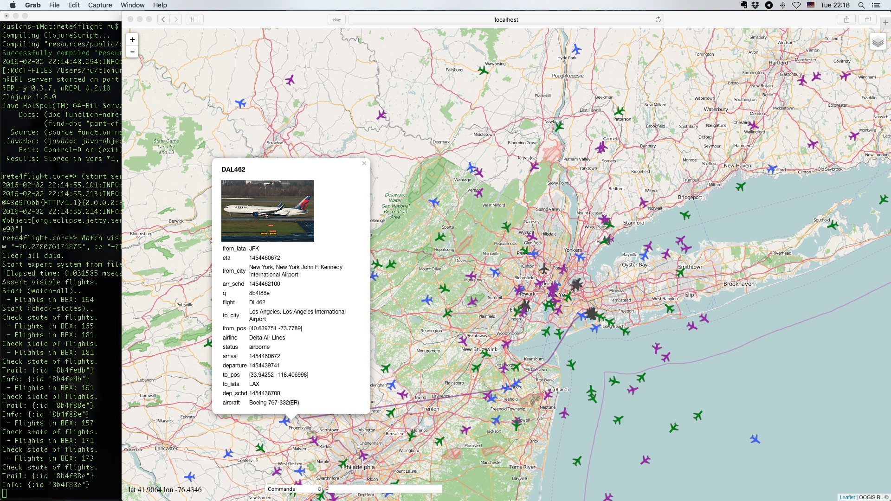

# rete4flights

Air traffic control system - a test example for the rete4frames expert system shell.



## Usage

1. Simplest start:
```
$ cd <..>/rete4flights
$ lein run
```
2. Start for developers with automatic start of a browser client:
```
$ cd <..>/rete4flights
$ lein repl
...
rete4flight.core=> (-main)
```
3. Start for developers for hand start of a browser client:
```
$ cd <..>/rete4flights
$ lein repl
...
rete4flight.core=> (start-server)
```
And open address http://localhost:3000 in a browser.

## Usage

First select in a "Commands" selector an item "Watch visible area". Then select an item "State of flights". This begins a process of collection and display information of flights in the visible area. Black icons means aircrafts on the ground, green ones - the descending aircrafts and blue -  the climbing. Subsequent changes or shifts of a window do not change of the area under control.
To do this execute the "Watch visible area" command once more in needed place.

Command "Intersection" calculates aircrafts that intersect in 6 minutes on a distance less then 400 meters (altitude differense less than 10000 feet). If you click on a link between aircrafts you know accurate values.

Click on an aircraft icon brings up a popup with general data of a flight and two buttons. Button "Inform" provides a popup with detailed information of the flight. Button "Trail" draws a current way of the aircraft.

Copyright and license
----

Copyright © 2016 Ruslan Sorokin.

Licensed under the EPL (see the file epl.html).
# rete4flights
